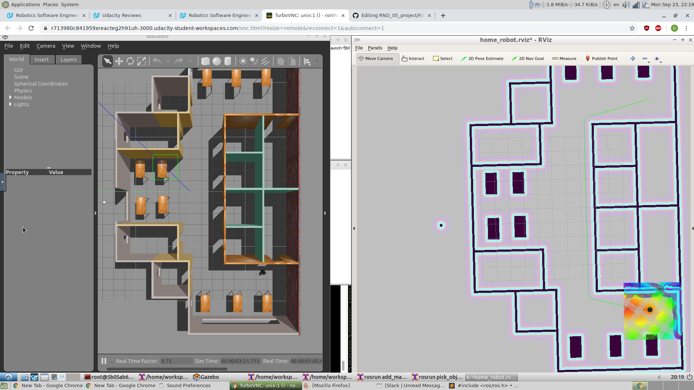

# RND_05_project

<p align="center">
  
</p>

### Dependencies

ROS : Kinetic (turtlebot, kobuki not support melodic)
Ubuntu : 16.04 (for ROS Kinetic)
```
sudo apt install xterm
sudo apt install ros-kinetic-amcl
sudo apt install ros-kinetic-move-base
sudo apt install ros-kinetic-map-server
```

### How to run

```
cd ~
git clone https://github.com/kurbakov/RND_05_project
cd RND_05_project/catkin
catkin_make && source_devel/setup.bash
./home_service.sh
```
* Important: in catkin worlspace I keep only symbolic links to packages.

### Short description

Current repository provides the implementation in the virtual environment of the home service robot.
The robot is programmed to go to the location 1 (-7.5,-7.0), pickup imaginary object and pring it to the location 2 (7.5,-7.0).


We will be using the ROS Navigation stack, which is based on the Dijkstra's, a variant of the Uniform Cost Search algorithm, to plan our robot trajectory from start to goal position. The ROS navigation stack permits your robot to avoid any obstacle on its path by re-planning a new trajectory once your robot encounters them.

